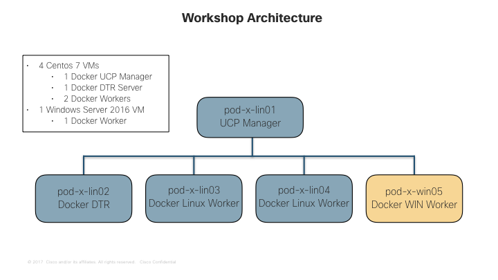

# Deploying Multi-OS applications to Docker EE
Docker EE 17.06 is the first Containers-as-a-Service platform to offer production-level support for the integrated management and security of Linux AND Windows Server Containers.

In this lab we'll build a Docker EE cluster comprised of Windows and Linux nodes. Then we'll deploy both a Linux and Windows web app, as well as a multi-service application that includes both Windows and Linux components.

> **Difficulty**: Intermediate (assumes basic familiarity with Docker)

> **Time**: Approximately 60 minutes

> **Tasks:**
>
> * [Prerequisites](#prerequisites)
> * [Task 1: Deploy Contiv](#task1)
> * [Task 1.1: Deploy SSH Keys](#task1.1)
> * [Task 1.2: Download and Deploy Contiv](#task1.2)


## Document Conventions

- When you encounter a phrase between `<` and `>` you are meant to substitue a different value.
	For example: if you see `<linux vm name>` you would actually type something like `pod-1-lin01`

- When you see the Linux Penguin, all of the following instructions should be executed in one of your Linux VMs.

	
	
- When you see the Windows Flag, all of the subsequent instructions should be completed in your Windows VM.

	
	
### Virtual Machine Naming Conventions
Your VMs are named in the following convention pod-X-[OS]YY.csc.pittsburgh.cisco.com
Where X is the pod number [OS] is the Operating System type and YY is the Node number.  

> For example: `pod-3-lin02` or `pod-3-win01`

### Virtual Machine Roles
This lab uses a total of five virtual machines

The Docker EE cluster you will be building will be comprised of five nodes - 4 Linux nodes running Centos7 and 1 Windows node running Server 2016.



## <a name="prerequisites"></a>Prerequisites

You will be provided a set of five virtual machines (four Linux and 1 Windows), which we will be configuring with Docker	. You do not need Docker running on your laptop, but you will need a Remote Desktop client to connect to the Windows VM, and an SSH client to connect into the Linux one.
### 1. RDP Client

- Windows - use the built-in Remote Desktop Connection app.
- Mac - install [Microsoft Remote Desktop](https://itunes.apple.com/us/app/microsoft-remote-desktop/id715768417?mt=12) from the app store.
- Linux - install [Remmina](http://www.remmina.org/wp/), or any RDP client you prefer.

### 2. SSH Client

- Windows - [Download Putty](http://www.chiark.greenend.org.uk/~sgtatham/putty/download.html)
- Linux - Use the built in SSH client
- Mac - Use the built in SSH client

> **Note**: When you connect to the Windows VM, if you are prompted to run Windows Update, you should cancel out. The labs have been tested with the existing VM state and any changes may cause problems.

## <a name="task1"></a>Task 1:  Deploy Contiv


##<a name="task1.1"></a>Task1.1: Deploy SSH Keys

1. Either in a terminal window (Mac or Linux) or using Putty (Windows) SSH into Linux node **01** using the IP Address. The IP Address can be found on your lab information paper.  The username is `docker` and the password is `Docker2017`

	```
	ssh docker@<pod-X-lin01>
	```
	
2. Create ssh Keys
	
	Run the following command and accept the defaults
	
	```
	ssh-keygen
	```
	
The output should look similar to the following.
	

	```
	[root@pod-2-lin01 contiv-1.1.2]# ssh-keygen
	Generating public/private rsa key pair.
	Enter file in which to save the key (/root/.ssh/id_rsa): 
	Created directory '/root/.ssh'.
	Enter passphrase (empty for no passphrase): 
	Enter same passphrase again: 
	Your identification has been saved in /root/.ssh/id_rsa.
	Your public key has been saved in /root/.ssh/id_rsa.pub.
	The key fingerprint is:
	e1:0e:0e:82:e8:9c:3e:48:d7:ea:fb:22:59:59:f6:79 root@pod-2-lin01
	The key's randomart image is:
	+--[ RSA 2048]----+
	|                 |
	|                 |
	|        .        |
	|..   o . .       |
	|o . * o S        |
	|o..= + = E       |
	|o++ . . o        |
	|o+ o             |
	| .+o+.           |
	+-----------------+
	```	

3. Copy the keys to all of the linux hosts.  The following command must be run for all 4 Linux hosts
	
	```
	ssh-copy-id root@<pod-X-lin01 IP Address>
	```
	
	You should see simlar output to the below:

	```
	The authenticity of host '10.87.88.137 (10.87.88.137)' can't be established.
	ECDSA key fingerprint is fe:33:93:ff:f5:77:ed:65:c0:1e:c4:8d:58:81:f8:de.
	Are you sure you want to continue connecting (yes/no)? yes
	/usr/bin/ssh-copy-id: INFO: attempting to log in with the new key(s), to filter out any that are already 	installed
	/usr/bin/ssh-copy-id: INFO: 1 key(s) remain to be installed -- if you are prompted now it is to install the new 	keys
	root@10.87.88.137's password: 
	Full path required for exclude: net:[4026532443].
	Full path required for exclude: net:[4026532611].
	Full path required for exclude: net:[4026532684].
	Full path required for exclude: net:[4026532816].

	Number of key(s) added: 1

	Now try logging into the machine, with:   "ssh 'root@10.87.88.137'"
	and check to make sure that only the key(s) you wanted were added.
	```

##<a name="task1.1"></a>Task1.1: Download and Deploy Contiv

1. Download the Contiv Installation Files
	
	```
	curl -L -O https://github.com/contiv/install/releases/download/1.1.2/contiv-1.1.2.tgz
	```
	
	```
	[docker@pod-2-lin01 ~]$ curl -L -O https://github.com/contiv/install/releases/download/1.1.2/contiv-1.1.2.tgz
  % Total    % Received % Xferd  Average Speed   Time    Time     Time  Current
                                 Dload  Upload   Total   Spent    Left  Speed
100   606    0   606    0     0    736      0 --:--:-- --:--:-- --:--:--   736
100 2494k  100 2494k    0     0   754k      0  0:00:03  0:00:03 --:--:-- 1404k
	```
	
	
2. Unzip the tar file

	
	```
	tar oxf contiv-1.1.2.tgz
	```

3. Change directories to the extracted folder
	
	```
	cd contiv-1.1.2
	```

4.  Modify the ansible configuration file to match your pod information
	
	```
	vi install/ansible/aci_cfg.yml
	```
	
	This is an example:
	
	```
CONNECTION_INFO:
      10.87.88.135:
        role: master
        control: ens160
        data: ens192
      10.87.88.136:
        control: ens160
        data: ens192
      10.87.88.137:
        control: ens160
        data: ens192
      10.87.88.138:
        control: ens160
        data: ens192
APIC_URL: "https://:443"
APIC_USERNAME: ""
APIC_PASSWORD: ""
APIC_PHYS_DOMAIN: "docker-contiv"

APIC_EPG_BRIDGE_DOMAIN: "not_specified"
APIC_CONTRACTS_UNRESTRICTED_MODE: "no"

APIC_LEAF_NODES:
    - topology/pod-1/paths-101/pathep-[eth1/5]
    - topology/pod-1/paths-102/pathep-[eth1/5]
	```
	
	Save the file.
> **Note**: IF you are not familiar with VI please let a proctor know and we will walk you through this process.
	
5. Run the contiv install command
	
